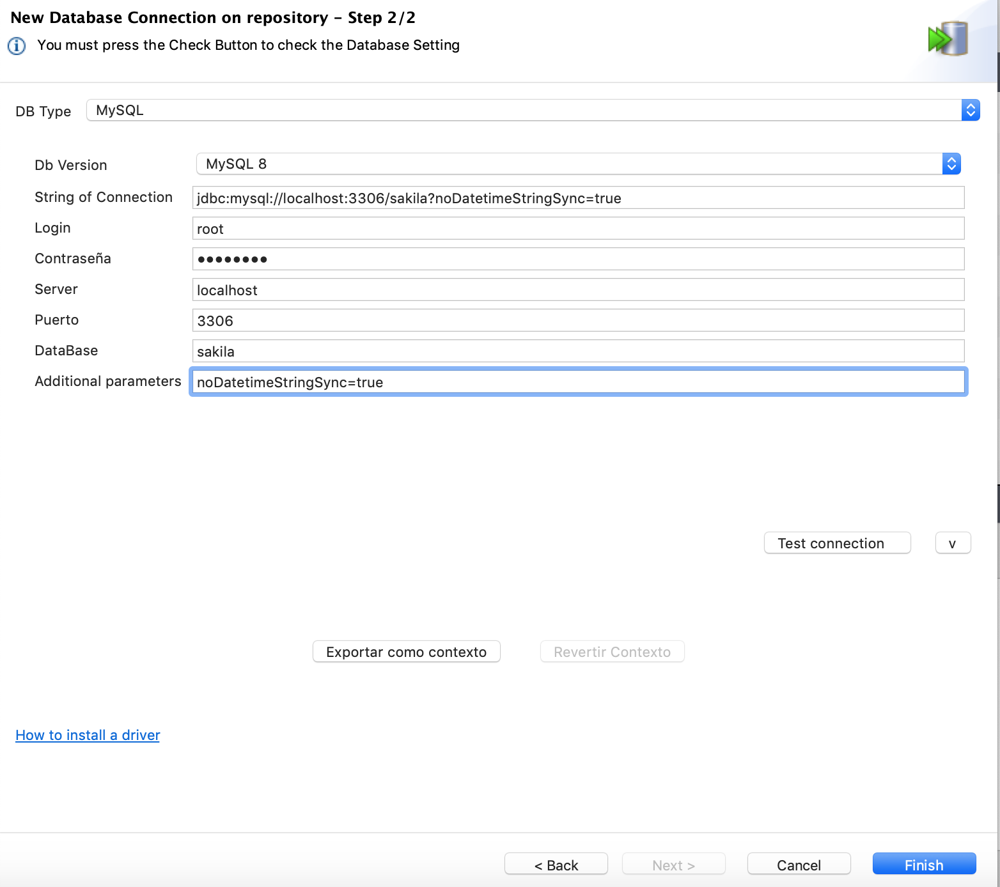

# TALEND
- Andrés Felipe Avendaño Restrepo
- Douglas Ardila Garcés
- Julian Andres Sanchez
- Sebastian Ospina Cabarcas
## Pasos a seguir
- 1. Ejecutar en MySql y dentro de la base de datos Sakila los esquemas Olap: esquemaOlap.sql esquemaQuiz.sql
- 2. En talend crear una nueva conexion con la base de datos MySql

        

Figura 1.

        

Figura 2.

        

Figura 3.

        

Figura 4.

        

Figura 5.
